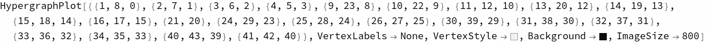
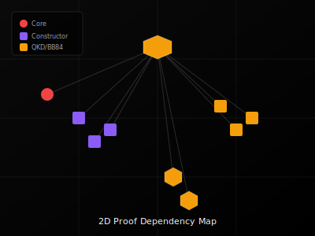
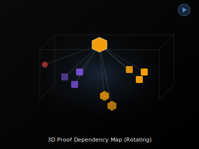
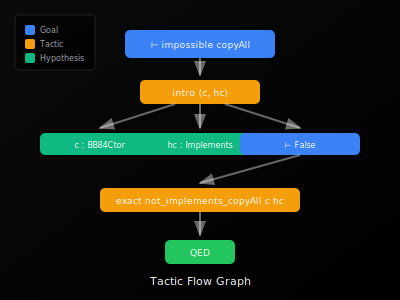
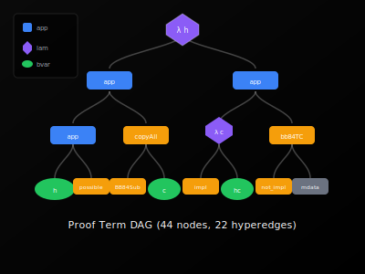
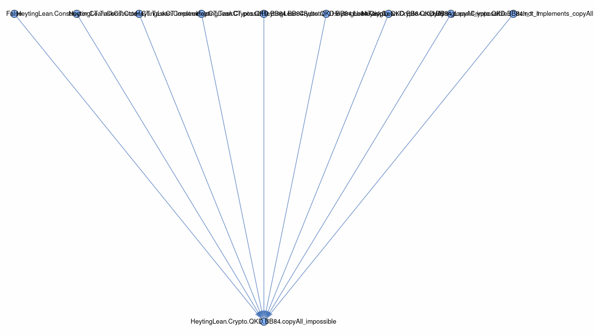
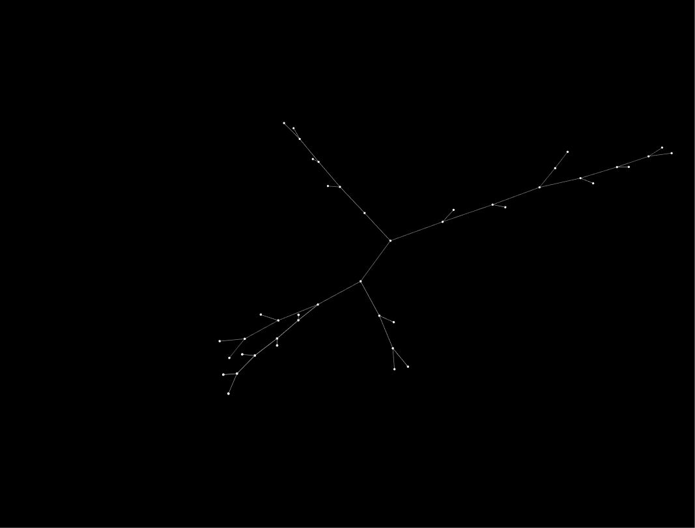
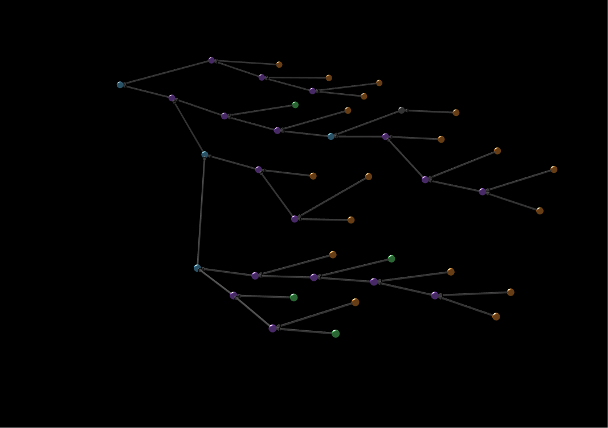

<sub><strong>Our tech stack is ontological:</strong><br>
<strong>Hardware — Physics</strong><br>
<strong>Software — Mathematics</strong><br><br>
<strong>Our engineering workflow is simple:</strong> discover, build, grow, learn & teach</sub>

---

<sub>
<strong>Notice of Proprietary Information</strong><br>
This document outlines foundational concepts and methodologies developed during internal research and development at Apoth3osis. To protect our intellectual property and adhere to client confidentiality agreements, the code, architectural details, and performance metrics presented herein may be simplified, redacted, or presented for illustrative purposes only. This paper is intended to share our conceptual approach and does not represent the full complexity, scope, or performance of our production-level systems. The complete implementation and its derivatives remain proprietary.
</sub>

---

# Wolfram Physics ↔ Lean 4 Proof Bridge


## Credo

> *"The question of whether a computer can think is no more interesting than the question of whether a submarine can swim."*
> — **Edsger W. Dijkstra**

What matters is not the substrate but the structure. This project bridges two paradigms of understanding structure: **Wolfram Physics** hypergraph rewriting as a model of fundamental physics, and **Lean 4** proof terms as a model of mathematical truth. Both represent complex relationships through directed graphs—one physical, one logical. By establishing a lossless bidirectional protocol between them, we enable:

1. **Visualization**: Render formal proofs in the striking visual style of Wolfram Physics
2. **Verification**: Use Lean's kernel to witness properties of hypergraph structures
3. **Cross-pollination**: Apply insights from one domain to the other

### Acknowledgment

We humbly thank the collective intelligence of humanity for providing the technology and culture we cherish. We do our best to properly reference the authors of the works utilized herein, though we may occasionally fall short. Our formalization acts as a reciprocal validation—confirming the structural integrity of their original insights while securing the foundation upon which we build. In truth, all creative work is derivative; we stand on the shoulders of those who came before, and our contributions are simply the next link in an unbroken chain of human ingenuity.

---

**A bidirectional, lossless bridge between Wolfram Physics hypergraph evolution and Lean 4 formal proof verification.**

<p align="center">
  <a href="https://abraxas1010.github.io/heyting-wolfram-proofs/RESEARCHER_BUNDLE/artifacts/visuals/bridge_viewer.html">
    
  </a>
</p>

<p align="center">
  <em>Actual WolframModelPlot output from proof_term_hypergraph</em><br/>
  <a href="https://abraxas1010.github.io/heyting-wolfram-proofs/RESEARCHER_BUNDLE/artifacts/visuals/bridge_viewer.html">▶ Open Interactive Bridge Viewer</a>
</p>

---

## Interactive Visualizations

<table>
<tr>
<td align="center" width="50%">
<strong>2D Proof Map</strong><br/>
<em>Pan, zoom, search declarations</em><br/>
<a href="https://abraxas1010.github.io/heyting-wolfram-proofs/RESEARCHER_BUNDLE/artifacts/visuals/wolfram_2d.html">
  
</a><br/>
<a href="https://abraxas1010.github.io/heyting-wolfram-proofs/RESEARCHER_BUNDLE/artifacts/visuals/wolfram_2d.html">▶ Open 2D Map</a>
</td>
<td align="center" width="50%">
<strong>3D Proof Map</strong><br/>
<em>Rotate, zoom, click nodes</em><br/>
<a href="https://abraxas1010.github.io/heyting-wolfram-proofs/RESEARCHER_BUNDLE/artifacts/visuals/wolfram_3d.html">
  
</a><br/>
<a href="https://abraxas1010.github.io/heyting-wolfram-proofs/RESEARCHER_BUNDLE/artifacts/visuals/wolfram_3d.html">▶ Open 3D Map</a>
</td>
</tr>
<tr>
<td align="center" width="50%">
<strong>Tactic Flow Graph</strong><br/>
<em>Proof tactics and goal transformations</em><br/>
<a href="https://abraxas1010.github.io/heyting-wolfram-proofs/RESEARCHER_BUNDLE/artifacts/visuals/tactic_flow.html">
  
</a><br/>
<a href="https://abraxas1010.github.io/heyting-wolfram-proofs/RESEARCHER_BUNDLE/artifacts/visuals/tactic_flow.html">▶ Open Tactic Flow</a>
</td>
<td align="center" width="50%">
<strong>Proof Term DAG</strong><br/>
<em>Abstract syntax tree of proof terms</em><br/>
<a href="https://abraxas1010.github.io/heyting-wolfram-proofs/RESEARCHER_BUNDLE/artifacts/visuals/proof_term_dag.html">
  
</a><br/>
<a href="https://abraxas1010.github.io/heyting-wolfram-proofs/RESEARCHER_BUNDLE/artifacts/visuals/proof_term_dag.html">▶ Open Proof DAG</a>
</td>
</tr>
</table>

### Wolfram Physics Output

| Visualization | Description |
|---------------|-------------|
| <a href="https://abraxas1010.github.io/heyting-wolfram-proofs/RESEARCHER_BUNDLE/artifacts/visuals/proof_HeytingLean_Crypto_QKD_BB84_copyAll_impossible_value_term_hypergraph.png"></a> | **Hypergraph** — WolframModelPlot rendering of proof term structure (22 hyperedges) |
| <a href="https://abraxas1010.github.io/heyting-wolfram-proofs/RESEARCHER_BUNDLE/artifacts/visuals/proof_HeytingLean_Crypto_QKD_BB84_copyAll_impossible_value_term_dag.png"></a> | **Layered DAG** — Proof term tree with depth-based layout (44 nodes, max depth 8) |
| <a href="https://abraxas1010.github.io/heyting-wolfram-proofs/RESEARCHER_BUNDLE/artifacts/visuals/constdeps_HeytingLean_Crypto_QKD_BB84_copyAll_impossible_dag.png"></a> | **Const Dependencies** — Which lemmas/definitions the theorem uses (10 dependencies) |

### 3D Visualizations (X3D/WebGL)

| 3D View | Download |
|---------|----------|
| <a href="https://abraxas1010.github.io/heyting-wolfram-proofs/RESEARCHER_BUNDLE/artifacts/visuals/proof_HeytingLean_Crypto_QKD_BB84_copyAll_impossible_value_term_hypergraph_3d.png"></a> | **3D Hypergraph** — [Download X3D](RESEARCHER_BUNDLE/artifacts/visuals/proof_HeytingLean_Crypto_QKD_BB84_copyAll_impossible_value_term_hypergraph.x3d) for VR/3D viewing |
| <a href="https://abraxas1010.github.io/heyting-wolfram-proofs/RESEARCHER_BUNDLE/artifacts/visuals/proof_HeytingLean_Crypto_QKD_BB84_copyAll_impossible_value_term_dag_3d.png"></a> | **3D Proof DAG** — [Download X3D](RESEARCHER_BUNDLE/artifacts/visuals/proof_HeytingLean_Crypto_QKD_BB84_copyAll_impossible_value_term_dag.x3d) for VR/3D viewing |

---

## Why This Matters

| Wolfram Physics | Lean 4 Proofs |
|-----------------|---------------|
| Hyperedges connect multiple vertices | Proof terms compose via application |
| Rewriting rules evolve state | Tactics transform goals |
| Causal graphs show dependencies | Term DAGs show proof structure |
| SetReplace visualization | Type-theoretic verification |

**The bridge enables:**

- Export Lean proof terms as Wolfram-style hypergraphs
- Visualize proof structure using `WolframModelPlot`
- Generate deterministic derivation witnesses in Wolfram
- Verify witnesses in Lean's trusted kernel
- Byte-identical roundtrip (lossless binary protocol)

---

## Key Components

### 1. Proof Term → Hypergraph Encoding

The `proof_term_hypergraph` executable exports Lean proof terms as hypergraphs where each hyperedge represents a term application: `(premises → conclusion)` = `(children ++ [parent])`.

```bash
lake exe proof_term_hypergraph -- \
  --module HeytingLean.Crypto.QKD.BB84 \
  --const HeytingLean.Crypto.QKD.BB84.copyAll_impossible \
  --expr value --fuel 1024 --viz --witness
```

**Output:**
- `*_hypergraph.bin` — Binary hyperedge data (Int64 LE)
- `*_lengths.bin` — Edge lengths (Int64 LE)
- `*_metadata.json` — Node labels, types, depths
- `*_term_hypergraph.png` — Wolfram Physics style visualization
- `*_term_dag.png` — Layered proof DAG

### 2. Wolfram Physics Visualization

The `proof_hypergraph_visualize.wls` script renders hypergraphs using SetReplace's `WolframModelPlot`:

```wolfram
WolframModelPlot[hyper,
  VertexSize -> 0.25,
  VertexLabels -> ...
]
```

### 3. Bidirectional Witness Protocol

```
┌─────────────────────────────────────────────────────────────┐
│  Lean 4                                                     │
│    proof_term_hypergraph --witness                          │
│    ↓ export binary + JSON                                   │
├─────────────────────────────────────────────────────────────┤
│  Wolfram Engine                                             │
│    proof_hypergraph_witness.wls                             │
│    → Generates deterministic toposort derivation            │
│    ↓ returns JSON witness                                   │
├─────────────────────────────────────────────────────────────┤
│  Lean 4 (verification)                                      │
│    verifyWitness() confirms:                                │
│    ✓ derivedRoot matches expected                           │
│    ✓ Topological order: premises before parent              │
│    ✓ Each step's edge exists in hypergraph                  │
└─────────────────────────────────────────────────────────────┘
```

---

## Quick Start

### Prerequisites

- **Lean 4** with Lake build system
- **Wolfram Engine** 14.x with activated license
- **SetReplace** package: `PacletInstall["SetReplace"]`

### Build

```bash
cd RESEARCHER_BUNDLE
lake build proof_term_hypergraph
```

### Run

```bash
# Echo demo (lossless roundtrip test)
lake exe wolfram_roundtrip -- --echo

# Full proof visualization pipeline
lake exe proof_term_hypergraph -- \
  --const HeytingLean.Crypto.QKD.BB84.copyAll_impossible \
  --module HeytingLean.Crypto.QKD.BB84 \
  --expr value --fuel 1024 --viz --witness
```

### Expected Output

```
[viz] exported plots under: .tmp/proof_term_hypergraph/...
[witness] OK (Wolfram witness verified by Lean)
Wrote:
  *_value_metadata.json
  *_value_hypergraph.bin
  *_value_lengths.bin
  *_constdeps_metadata.json
  *_constdeps_hypergraph.bin
  *_constdeps_lengths.bin
```

---

## File Structure

```
heyting-wolfram-proofs/
├── README.md                          # This file
├── LICENSE                            # MIT License
├── assets/
│   ├── Apoth3osis.webp                # Logo
│   └── bridge_hero.svg                # Hero visualization
├── docs/
│   ├── 01_Architecture.md             # System design
│   ├── 02_Binary_Protocol.md          # Wire format specification
│   └── 03_Reproducibility.md          # Build instructions
└── RESEARCHER_BUNDLE/
    ├── HeytingLean/
    │   └── CLI/
    │       ├── ProofTermHypergraphMain.lean   # Proof → hypergraph
    │       ├── WolframRoundtripMain.lean      # Lossless roundtrip
    │       └── Args.lean                      # CLI utilities
    ├── ffi/
    │   └── heyting_wolfram_bridge/
    │       ├── proof_hypergraph_visualize.wls # Wolfram viz
    │       ├── proof_hypergraph_witness.wls   # Witness generator
    │       └── echo_hypergraph_binary.wls     # Roundtrip helper
    ├── artifacts/
    │   └── visuals/
    │       ├── index.html                     # Visualization landing
    │       └── bridge_viewer.html             # Interactive viewer
    └── scripts/
        └── verify.sh                          # Verification script
```

---

## Binary Protocol

### Hypergraph Format

Hyperedges are stored as two paired binary files:

| File | Format | Description |
|------|--------|-------------|
| `*_hypergraph.bin` | Int64 LE array | Flattened vertex IDs |
| `*_lengths.bin` | Int64 LE array | Length of each hyperedge |

**Reconstruction:**
```wolfram
data = BinaryReadList[dataPath, "Integer64"];
lengths = BinaryReadList[lengthsPath, "Integer64"];
hypergraph = TakeList[data, lengths];
```

### Encoding Convention

Each hyperedge `[v₀, v₁, ..., vₙ₋₁, parent]` represents:
- `v₀ ... vₙ₋₁` = premises/children
- `parent` = conclusion (last element)

This mirrors both:
- **Wolfram Physics**: Multi-vertex connections
- **Lean proof terms**: `f arg₁ arg₂ ... argₙ` where `f` is the parent

---

## Verification

```bash
# Run all checks
./scripts/verify.sh

# Manual verification
lake exe proof_term_hypergraph -- --help
lake exe wolfram_roundtrip -- --echo
```

---

## References

- [Wolfram Physics Project](https://www.wolframphysics.org/)
- [SetReplace Package](https://github.com/maxitg/SetReplace)
- [Lean 4 Documentation](https://lean-lang.org/)
- [HeytingLean](https://github.com/Apoth3osis/HeytingLean) — Parent project

---

## License

MIT License — see [LICENSE](LICENSE)

---

<p align="center">
  <sub>Part of the <a href="https://github.com/Apoth3osis/HeytingLean">HeytingLean</a> project</sub><br/>
  <sub><a href="https://apoth3osis.io">apoth3osis.io</a></sub>
</p>
